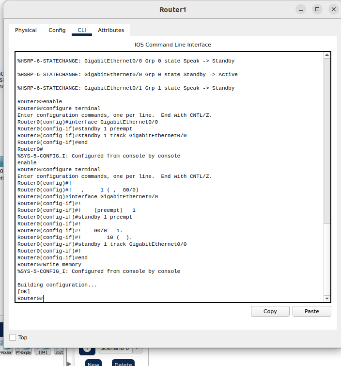
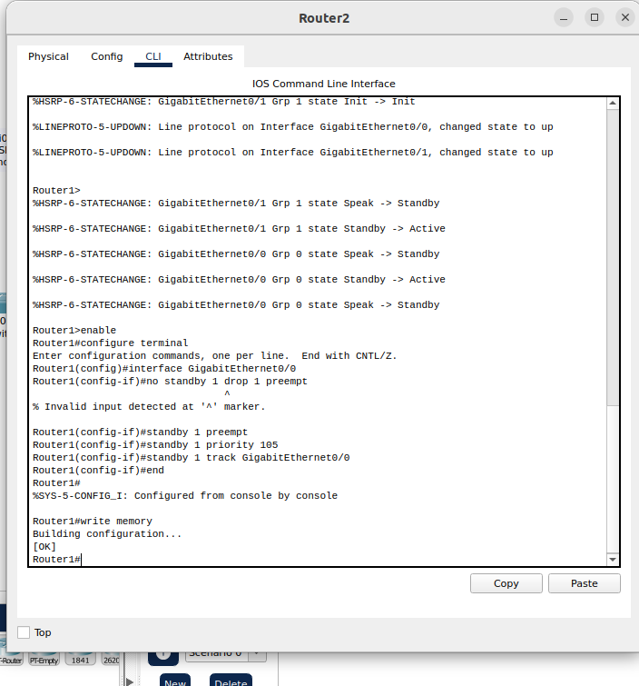
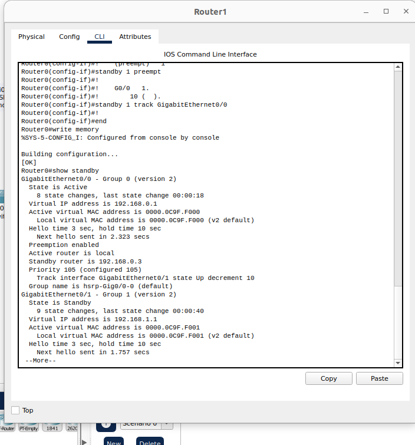
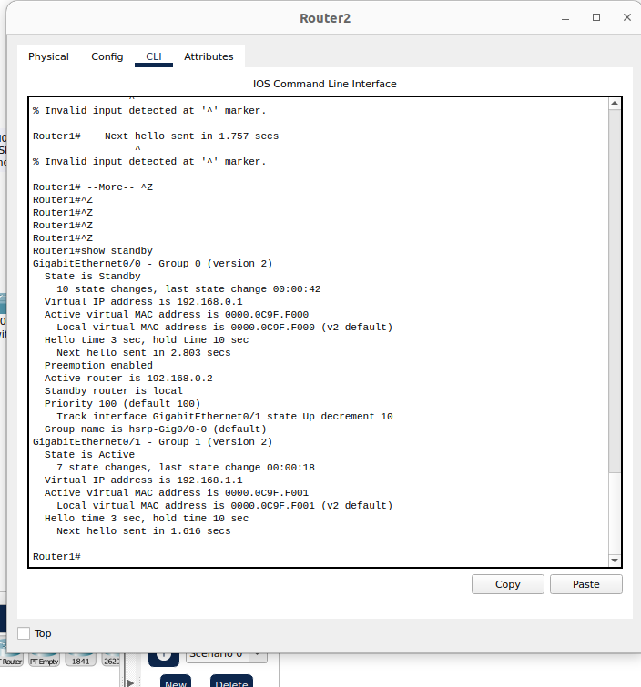
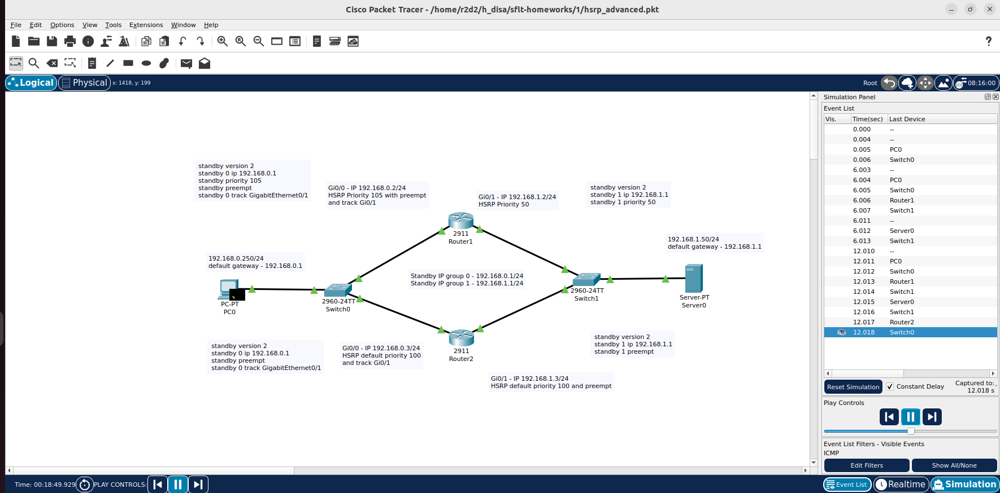
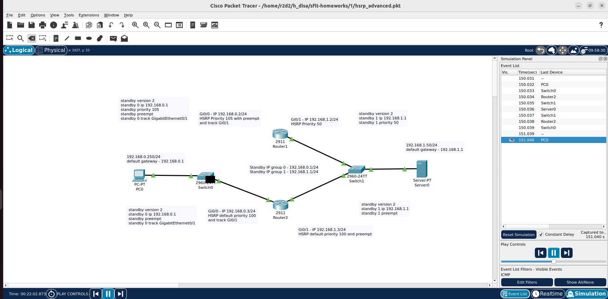

# Домашнее задание к занятию "Disaster Recovery. FHRP и Keepalived" - Котов Г.И.

### Задание 1
1. Дана схема для Cisco Packet Tracer, рассматриваемая в лекции.
На данной схеме уже настроено отслеживание интерфейсов маршрутизаторов Gi0/1 (для нулевой группы)
2. Необходимо аналогично настроить отслеживание состояния интерфейсов Gi0/0 (для первой группы).
3. Для проверки корректности настройки, разорвите один из кабелей между одним из маршрутизаторов и Switch0 и запустите ping между PC0 и Server0.
4. На проверку отправьте получившуюся схему в формате pkt и скриншот, где виден процесс настройки маршрутизатора.

### Решение 1: 

### Задание 2

1. Запустите две виртуальные машины Linux, установите и настройте сервис Keepalived как в лекции, используя пример конфигурационного файла.
2. Настройте любой веб-сервер (например, nginx или simple python server) на двух виртуальных машинах
3. Напишите Bash-скрипт, который будет проверять доступность порта данного веб-сервера и существование файла index.html в root-директории данного веб-сервера.
4. Настройте Keepalived так, чтобы он запускал данный скрипт каждые 3 секунды и переносил виртуальный IP на другой сервер, если bash-скрипт завершался с кодом, отличным от нуля (то есть порт веб-сервера был недоступен или отсутствовал index.html). Используйте для этого секцию vrrp_script
5. На проверку отправьте получившейся bash-скрипт и конфигурационный файл keepalived, а также скриншот с демонстрацией переезда плавающего ip на другой сервер в случае недоступности порта или файла index.html

#### Решение 2:

